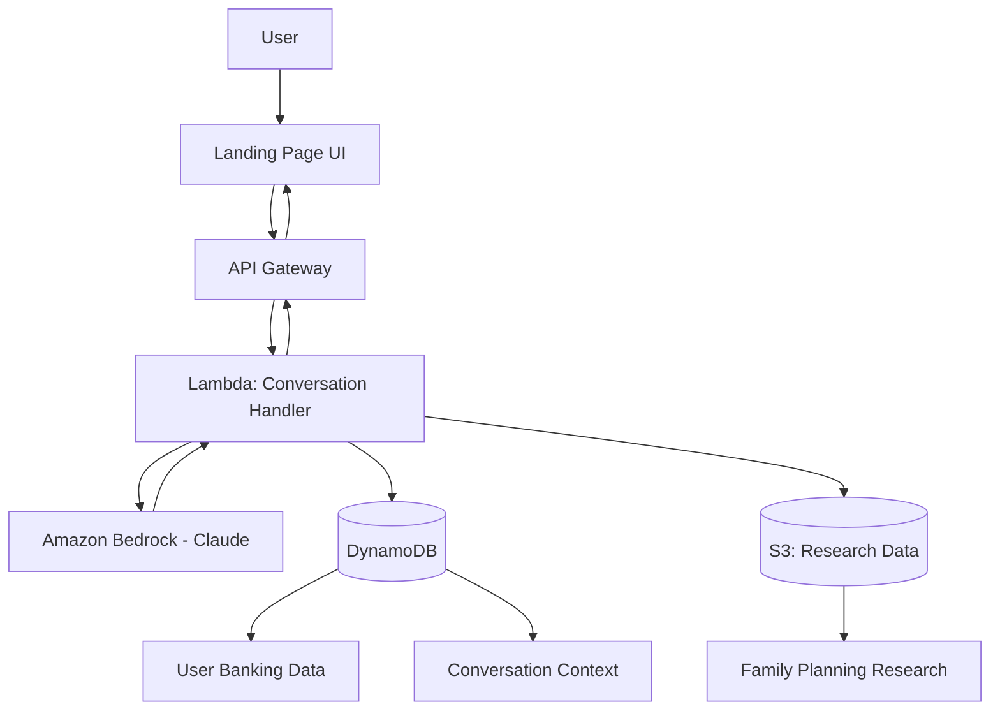

# Design Document: Bloom AI

## Overview

Bloom AI is a conversational AI system that provides personalized family planning financial guidance to banking customers. The system integrates user banking data (age, income, location, gender) with research data on family planning methods to deliver tailored recommendations through a natural language interface.

### Core Concept

Users access Bloom AI through their banking app's landing page, which presents suggested conversation prompts. The AI agent conducts empathetic conversations to understand the user's family planning goals, then combines this information with banking data and research databases to provide:

- Cost estimates for different family planning methods (IVF, adoption, natural, surrogacy)
- Personalized financial product recommendations (savings accounts, investments, loans)
- Actionable timelines and savings targets
- Comparative analysis of different family planning approaches

### Hackathon Constraints

This design prioritizes rapid MVP delivery within a 4-hour timeframe:

- AWS-only services for simplified integration
- Mock data sources where full integration is impractical
- Focus on demonstrating one complete user journey
- Minimal frontend with emphasis on backend AI capabilities
- Pre-configured AWS services to minimize setup time

### Success Criteria

The MVP successfully demonstrates:
1. A functional landing page with conversation prompts
2. Natural language conversation with context retention
3. Integration of user data with research data
4. Generation of personalized financial recommendations
5. End-to-end user journey from prompt selection to action plan

## Architecture

### High-Level Architecture



### AWS Service Selection

**Amazon Bedrock (Claude 3.5 Sonnet)**
- Primary conversational AI engine
- Handles natural language understanding and generation
- Supports system prompts for empathetic, financial guidance tone
- No model training required - immediate availability
- Built-in context window management

**AWS Lambda**
- Serverless compute for conversation handling
- Orchestrates data retrieval and AI interactions
- Manages conversation flow and state
- Minimal setup - deploy code and go
- Auto-scaling for demo load

**Amazon API Gateway**
- REST API endpoints for frontend communication
- WebSocket support for real-time conversation (optional for MVP)
- Built-in authentication integration
- CORS configuration for web access

**Amazon DynamoDB**
- NoSQL database for user profiles and conversation history
- Single-table design for rapid setup
- Mock banking data storage
- Conversation context persistence
- Sub-millisecond latency

**Amazon S3**
- Static hosting for landing page (optional)
- Research database storage (JSON files)
- Pre-populated with family planning cost data
- Simple read access from Lambda

**AWS Secrets Manager**
- Secure storage for API keys and configuration
- Bedrock access credentials
- Database connection strings

### Architecture Rationale

**Serverless-First Approach**
- Zero infrastructure management during hackathon
- Pay-per-use pricing (minimal cost for demo)
- Instant deployment and scaling
- Focus development time on business logic

**Single Lambda Function**
- Simplified deployment and debugging
- Reduced inter-service latency
- Easier state management
- Sufficient for MVP scope

**DynamoDB Single-Table Design**
- One table for all entities (users, conversations, sessions)
- Partition key: `userId`, Sort key: `entityType#timestamp`
- Reduces setup complexity
- Supports all required access patterns

**Pre-Populated Research Data**
- S3 JSON files eliminate external API dependencies
- Predictable data structure for demo
- Fast local access from Lambda
- Easy to update and version

## Components and Interfaces

### Frontend Component: Landing Page

**Technology**: Static HTML/CSS/JavaScript (or React for rapid development)

**Responsibilities**:
- Display 3-4 suggested conversation prompts
- Provide free-form text input option
- Render conversation history
- Display AI responses with formatting
- Handle user authentication state

**Key UI Elements**:
```
┌─────────────────────────────────────┐
│  Bloom AI - Family Planning Advisor │
├─────────────────────────────────────┤
│                                     │
│  Suggested Prompts:                 │
│  ┌─────────────────────────────┐   │
│  │ I'm thinking about starting │   │
│  │ a family in the next 2 years│   │
│  └─────────────────────────────┘   │
│  ┌─────────────────────────────┐   │
│  │ What are my options for IVF?│   │
│  └─────────────────────────────┘   │
│  ┌─────────────────────────────┐   │
│  │ How much does adoption cost?│   │
│  └─────────────────────────────┘   │
│                                     │
│  Or start your own conversation:    │
│  ┌─────────────────────────────┐   │
│  │ Type your question...       │   │
│  └─────────────────────────────┘   │
└─────────────────────────────────────┘
```

**API Integration**:
- POST `/conversation/start` - Initialize new conversation
- POST `/conversation/message` - Send user message
- GET `/conversation/{sessionId}` - Retrieve conversation history

### Backend Component: Conversation Handler (Lambda)

**Runtime**: Python 3.12 (or Node.js 20.x)

**Responsibilities**:
- Receive and validate user messages
- Retrieve user banking data from DynamoDB
- Load conversation context from DynamoDB
- Construct prompts for Bedrock with system instructions
- Call Bedrock API with conversation history
- Parse AI responses
- Store updated conversation context
- Return formatted responses to frontend

**Key Functions**:
```python
def lambda_handler(event, context):
    """Main entry point for API Gateway requests"""
    
def start_conversation(user_id, initial_prompt):
    """Initialize new conversation session"""
    
def send_message(session_id, user_message):
    """Process user message and generate AI response"""
    
def get_user_profile(user_id):
    """Retrieve banking data and conversation context"""
    
def call_bedrock(messages, system_prompt):
    """Invoke Bedrock Claude model"""
    
def retrieve_research_data(method_type):
    """Load family planning data from S3"""
    
def generate_recommendations(user_profile, conversation_context):
    """Create personalized financial recommendations"""
```

**Environment Variables**:
- `DYNAMODB_TABLE_NAME`: User and conversation data table
- `S3_RESEARCH_BUCKET`: Research data bucket name
- `BEDROCK_MODEL_ID`: Claude model identifier
- `AWS_REGION`: Deployment region

### AI Component: Bedrock Integration

**Model**: Claude 3.5 Sonnet (anthropic.claude-3-5-sonnet-20241022-v2:0)

**System Prompt Template**:
```
You are Bloom AI, a compassionate financial advisor specializing in family planning guidance. 
You help banking customers understand the financial aspects of starting a family.

User Profile:
- Age: {age}
- Income: ${income}/year
- Location: {location}
- Gender: {gender}

Your responsibilities:
1. Ask thoughtful questions about family planning goals
2. Provide accurate cost estimates based on research data
3. Recommend appropriate financial products (savings, investments, loans)
4. Create personalized action plans with timelines
5. Maintain an empathetic, supportive tone

Available family planning methods: IVF, Adoption, Natural Conception, Surrogacy

Research data available:
{research_data_summary}

Financial products available:
{product_catalog_summary}

Guidelines:
- Be empathetic when discussing sensitive topics
- Provide specific numbers and timelines
- Reference user's banking data naturally
- Acknowledge limitations when uncertain
- Focus on actionable next steps
```

**Conversation Flow Management**:
- Maintain message history (user + assistant messages)
- Inject user profile data into system prompt
- Include relevant research data in context
- Limit context window to last 10 exchanges for MVP
- Track conversation state (greeting, discovery, recommendation, action_plan)

### Data Integration Service (Lambda Functions)

**Implemented as helper functions within main Lambda**:

**`get_banking_data(user_id)`**:
- Query DynamoDB for user banking profile
- Return: `{age, income, location, gender}`
- Mock data for hackathon demo

**`get_research_data(method_type=None)`**:
- Load JSON from S3: `research-data/family-planning-costs.json`
- Filter by method type if specified
- Return cost ranges, timelines, location-specific data

**`get_product_catalog(user_profile)`**:
- Load JSON from S3: `products/financial-products.json`
- Filter products based on user income and goals
- Return relevant savings accounts, investment options, loans

**`update_conversation_context(session_id, new_data)`**:
- Append new information to conversation context
- Store in DynamoDB with timestamp
- Maintain conversation state machine

## Data Models

### DynamoDB Schema (Single Table Design)

**Table Name**: `bloom-ai-data`

**Primary Key**:
- Partition Key: `PK` (String)
- Sort Key: `SK` (String)

**Global Secondary Index** (optional for MVP):
- GSI1PK: `entityType`
- GSI1SK: `timestamp`

**Entity Types**:

**User Profile**:
```json
{
  "PK": "USER#12345",
  "SK": "PROFILE",
  "entityType": "user_profile",
  "userId": "12345",
  "age": 32,
  "income": 85000,
  "location": "Seattle, WA",
  "gender": "female",
  "createdAt": "2024-01-15T10:30:00Z",
  "updatedAt": "2024-01-15T10:30:00Z"
}
```

**Conversation Session**:
```json
{
  "PK": "USER#12345",
  "SK": "SESSION#2024-01-15T14:30:00Z",
  "entityType": "conversation_session",
  "sessionId": "sess_abc123",
  "userId": "12345",
  "status": "active",
  "startedAt": "2024-01-15T14:30:00Z",
  "lastMessageAt": "2024-01-15T14:35:00Z",
  "conversationState": "discovery",
  "collectedInfo": {
    "familyPlanningGoal": "IVF within 2 years",
    "relationshipStatus": "partnered",
    "lifeChanges": "recently married",
    "preferredMethod": "IVF"
  }
}
```

**Conversation Message**:
```json
{
  "PK": "SESSION#sess_abc123",
  "SK": "MSG#2024-01-15T14:31:00Z",
  "entityType": "message",
  "sessionId": "sess_abc123",
  "role": "user",
  "content": "I'm thinking about starting a family through IVF",
  "timestamp": "2024-01-15T14:31:00Z"
}
```

**Generated Recommendation**:
```json
{
  "PK": "SESSION#sess_abc123",
  "SK": "RECOMMENDATION#2024-01-15T14:40:00Z",
  "entityType": "recommendation",
  "sessionId": "sess_abc123",
  "recommendationType": "savings_account",
  "productId": "high_yield_savings_001",
  "productName": "Family Planning Savings Account",
  "rationale": "Based on your 2-year timeline and IVF costs of $15,000-$20,000",
  "targetAmount": 20000,
  "monthlySavings": 833,
  "timestamp": "2024-01-15T14:40:00Z"
}
```

### S3 Research Data Structure

**File**: `s3://bloom-ai-research/family-planning-costs.json`

```json
{
  "methods": {
    "ivf": {
      "name": "In Vitro Fertilization (IVF)",
      "costRange": {
        "min": 12000,
        "max": 25000,
        "currency": "USD",
        "perCycle": true
      },
      "averageCycles": 2.5,
      "timeline": {
        "preparation": "2-3 months",
        "perCycle": "4-6 weeks",
        "total": "6-12 months"
      },
      "locationFactors": {
        "urban": 1.2,
        "suburban": 1.0,
        "rural": 0.85
      },
      "additionalCosts": {
        "medications": {"min": 3000, "max": 7000},
        "testing": {"min": 1500, "max": 3000},
        "storage": {"annual": 500}
      },
      "successRates": {
        "under30": 0.45,
        "30to35": 0.38,
        "35to40": 0.28,
        "over40": 0.15
      }
    },
    "adoption": {
      "name": "Adoption",
      "costRange": {
        "domestic": {"min": 20000, "max": 45000},
        "international": {"min": 30000, "max": 60000},
        "foster": {"min": 0, "max": 2500},
        "currency": "USD"
      },
      "timeline": {
        "domestic": "1-3 years",
        "international": "2-4 years",
        "foster": "6-18 months"
      },
      "breakdown": {
        "agencyFees": {"min": 15000, "max": 30000},
        "legal": {"min": 2500, "max": 8000},
        "travel": {"min": 2000, "max": 10000},
        "homeStudy": {"min": 1000, "max": 3000}
      }
    },
    "natural": {
      "name": "Natural Conception",
      "costRange": {
        "prenatal": {"min": 2000, "max": 3000},
        "delivery": {"min": 5000, "max": 15000},
        "currency": "USD"
      },
      "timeline": {
        "conception": "variable",
        "pregnancy": "9 months",
        "total": "9-18 months"
      },
      "insuranceCoverage": {
        "typical": 0.80,
        "withDeductible": 5000
      }
    },
    "surrogacy": {
      "name": "Surrogacy",
      "costRange": {
        "min": 90000,
        "max": 150000,
        "currency": "USD"
      },
      "timeline": {
        "findingSurrogate": "3-6 months",
        "legal": "2-3 months",
        "pregnancy": "9 months",
        "total": "14-18 months"
      },
      "breakdown": {
        "surrogateCompensation": {"min": 40000, "max": 60000},
        "agencyFees": {"min": 20000, "max": 30000},
        "legal": {"min": 10000, "max": 15000},
        "medical": {"min": 15000, "max": 30000},
        "insurance": {"min": 5000, "max": 15000}
      }
    }
  }
}
```

**File**: `s3://bloom-ai-research/financial-products.json`

```json
{
  "products": [
    {
      "id": "high_yield_savings_001",
      "type": "savings_account",
      "name": "Family Planning Savings Account",
      "interestRate": 0.045,
      "minimumBalance": 1000,
      "features": [
        "4.5% APY",
        "No monthly fees",
        "Goal tracking tools",
        "Automatic transfers"
      ],
      "eligibility": {
        "minIncome": 30000,
        "minAge": 18
      },
      "recommendedFor": ["short_term", "medium_term"]
    },
    {
      "id": "investment_529_001",
      "type": "investment",
      "name": "Future Family 529 Plan",
      "expectedReturn": 0.07,
      "riskLevel": "moderate",
      "features": [
        "Tax-advantaged growth",
        "Flexible contributions",
        "Education expense coverage"
      ],
      "eligibility": {
        "minIncome": 50000,
        "minAge": 21
      },
      "recommendedFor": ["long_term"]
    },
    {
      "id": "personal_loan_001",
      "type": "loan",
      "name": "Family Planning Personal Loan",
      "amountRange": {"min": 5000, "max": 50000},
      "interestRate": 0.089,
      "termMonths": [24, 36, 48, 60],
      "features": [
        "Fixed rate 8.9% APR",
        "No prepayment penalty",
        "Fast approval",
        "Flexible terms"
      ],
      "eligibility": {
        "minIncome": 40000,
        "minCreditScore": 650,
        "minAge": 21
      },
      "recommendedFor": ["ivf", "adoption", "surrogacy"]
    }
  ]
}
```

### API Request/Response Models

**POST /conversation/start**

Request:
```json
{
  "userId": "12345",
  "initialPrompt": "I'm thinking about starting a family in the next 2 years"
}
```

Response:
```json
{
  "sessionId": "sess_abc123",
  "message": {
    "role": "assistant",
    "content": "That's wonderful that you're planning ahead! Starting a family is an exciting journey. I'd love to help you understand the financial aspects and create a personalized plan. To give you the best guidance, I have some information from your banking profile - you're 32 years old in Seattle with an annual income of $85,000. \n\nCould you tell me a bit more about your situation? Are you planning this journey with a partner, or are you considering this on your own?",
    "timestamp": "2024-01-15T14:30:15Z"
  },
  "conversationState": "discovery"
}
```

**POST /conversation/message**

Request:
```json
{
  "sessionId": "sess_abc123",
  "message": "I'm with my partner, and we're considering IVF"
}
```

Response:
```json
{
  "sessionId": "sess_abc123",
  "message": {
    "role": "assistant",
    "content": "Thank you for sharing that. IVF is a common path for many couples, and it's great that you're exploring this together.\n\nBased on current data, IVF typically costs between $12,000-$25,000 per cycle, with most people needing 2-3 cycles. In the Seattle area, costs tend to run about 20% higher than the national average. This means you should plan for approximately $30,000-$60,000 total.\n\nThe timeline usually involves:\n- 2-3 months of preparation\n- 4-6 weeks per cycle\n- Total timeline: 6-12 months\n\nGiven your income of $85,000/year and your 2-year timeline, I can recommend some financial strategies. Would you like me to suggest specific savings accounts or investment options that could help you reach this goal?",
    "timestamp": "2024-01-15T14:32:30Z"
  },
  "conversationState": "recommendation",
  "contextData": {
    "method": "ivf",
    "estimatedCost": 45000,
    "timeline": "2 years",
    "monthlySavingsNeeded": 1875
  }
}
```

## API Design

### REST Endpoints

**Base URL**: `https://api.bloom-ai.example.com/v1`

**Authentication**: AWS Cognito JWT tokens (or API key for MVP demo)

#### Conversation Endpoints

**POST /conversation/start**
- Initialize new conversation session
- Parameters: `userId`, `initialPrompt` (optional)
- Returns: `sessionId`, initial AI response
- Creates session record in DynamoDB
- Loads user banking profile

**POST /conversation/message**
- Send user message and receive AI response
- Parameters: `sessionId`, `message`
- Returns: AI response, updated conversation state
- Appends to conversation history
- Triggers Bedrock API call

**GET /conversation/{sessionId}**
- Retrieve full conversation history
- Returns: Array of messages with timestamps
- Used for page refresh/reconnection

**GET /conversation/{sessionId}/recommendations**
- Get all generated recommendations for session
- Returns: Array of financial recommendations
- Includes product details and rationale

#### User Profile Endpoints (Optional for MVP)

**GET /user/{userId}/profile**
- Retrieve user banking data
- Returns: User profile object
- Mock data for demo

**GET /user/{userId}/conversations**
- List all conversation sessions for user
- Returns: Array of session summaries
- Supports conversation resumption

### WebSocket API (Future Enhancement)

For real-time streaming responses:
- `wss://api.bloom-ai.example.com/ws`
- Connection: Authenticate with JWT
- Messages: JSON-formatted conversation messages
- Enables typing indicators and streaming AI responses


## Correctness Properties

*A property is a characteristic or behavior that should hold true across all valid executions of a system-essentially, a formal statement about what the system should do. Properties serve as the bridge between human-readable specifications and machine-verifiable correctness guarantees.*

### Property 1: Prompt Selection Initiates Conversation

*For any* suggested conversation prompt on the landing page, when a user selects that prompt, the system should initiate a conversation session with that prompt included in the initial context.

**Validates: Requirements 1.2**

### Property 2: Complete User Profile Creation

*For any* user with banking data (gender, age, location, income), when a conversation is initiated, the system should create a User_Profile containing all four banking data fields.

**Validates: Requirements 2.1, 2.2, 2.3, 2.4, 2.5**

### Property 3: Conversation Context Updates Profile

*For any* conversation where the user provides new information (relationship status, life changes, location updates), the system should update the User_Profile with all collected conversation context.

**Validates: Requirements 3.2, 3.3, 3.4, 3.5**

### Property 4: Research Data Retrieval for Recommendations

*For any* recommendation generation request with a specified family planning method, the system should retrieve both timeline data and cost data for that specific method from the research database.

**Validates: Requirements 4.1, 4.2, 4.4**

### Property 5: Recommendation Generation from Complete Profiles

*For any* user profile containing sufficient data (income, age, family planning goal, timeline), the system should generate at least one financial recommendation by retrieving and filtering products from the product catalog.

**Validates: Requirements 5.1, 5.2**

### Property 6: Contextual Product Recommendations

*For any* user profile with a specified timeline and financial situation, the system should recommend product types appropriate to that context (savings accounts for short/medium timelines, investments for long timelines, loans for high immediate costs with qualifying income).

**Validates: Requirements 5.3, 5.4, 5.5, 5.6**

### Property 7: Localized Cost Estimates

*For any* family planning method and user location, when providing cost estimates, the system should apply the location factor from the research database to adjust the base cost range and include timeline information.

**Validates: Requirements 6.1, 6.2, 6.3**

### Property 8: Conversation Context Persistence

*For any* active conversation session, all information shared by the user in previous messages should be maintained in the conversation context and accessible for generating subsequent responses.

**Validates: Requirements 7.1, 7.2, 7.3**

### Property 9: Complete Action Plan Generation

*For any* user profile with sufficient data, when generating an action plan, the system should include financial recommendations, timeline milestones, and savings targets calculated from cost data and user income.

**Validates: Requirements 8.1, 8.2, 8.3, 8.4**

### Property 10: Multi-Method Comparison Data

*For any* user request for comparison information, the system should provide data on multiple family planning methods including both cost ranges and timeline information for each method.

**Validates: Requirements 9.1, 9.2, 9.3**

### Property 11: Exploratory Information for Undecided Users

*For any* conversation where the user has not specified a preferred family planning method, the system should provide information covering all available methods (IVF, adoption, natural conception, surrogacy).

**Validates: Requirements 9.4**

### Property 12: Session Resumption Preserves Context

*For any* conversation session, if a user navigates away and later returns to that session, all previously collected conversation context should be preserved and available.

**Validates: Requirements 10.4**

### Property 13: Authenticated Data Access

*For any* request to access banking repository data, the system should include authentication credentials in the data access call.

**Validates: Requirements 11.1**

### Property 14: Secure Context Storage

*For any* conversation that ends, the system should store the conversation context with encryption enabled in the database.

**Validates: Requirements 11.4**

### Property 15: Limitation Acknowledgment

*For any* user question that falls outside the system's domain (not related to family planning, financial products, or cost estimates), the system should generate a response that explicitly acknowledges its limitations.

**Validates: Requirements 12.4**

## Error Handling

### Error Categories

**User Input Errors**:
- Empty or whitespace-only messages
- Invalid session IDs
- Malformed requests

**Data Retrieval Errors**:
- User profile not found
- Research data unavailable
- Product catalog access failure

**AI Service Errors**:
- Bedrock API timeout
- Rate limiting
- Model unavailability
- Context window exceeded

**System Errors**:
- DynamoDB connection failure
- S3 access denied
- Lambda timeout
- Memory exhaustion

### Error Handling Strategies

**Graceful Degradation**:
```python
def get_research_data(method_type):
    try:
        data = load_from_s3(f"research-data/{method_type}.json")
        return data
    except S3Error:
        # Fall back to cached/default data
        return get_default_research_data(method_type)
    except Exception as e:
        logger.error(f"Research data retrieval failed: {e}")
        return None
```

**User-Friendly Error Messages**:
- Bedrock timeout: "I'm taking a moment to think. Please bear with me..."
- Data unavailable: "I don't have specific cost data for that method right now, but I can provide general guidance..."
- Invalid input: "I didn't quite catch that. Could you rephrase your question?"

**Retry Logic**:
- Bedrock API calls: 3 retries with exponential backoff
- DynamoDB operations: 2 retries with jitter
- S3 reads: 2 retries

**Circuit Breaker Pattern**:
- If Bedrock fails 5 times in 60 seconds, switch to fallback responses
- Monitor error rates and alert if threshold exceeded

**Logging and Monitoring**:
- CloudWatch Logs for all errors
- CloudWatch Metrics for error rates
- X-Ray tracing for request flows
- Alarms for critical failures

### Validation Rules

**Input Validation**:
```python
def validate_message(message):
    if not message or not message.strip():
        raise ValidationError("Message cannot be empty")
    if len(message) > 2000:
        raise ValidationError("Message too long (max 2000 characters)")
    return message.strip()

def validate_session_id(session_id):
    if not re.match(r'^sess_[a-zA-Z0-9]{10,}$', session_id):
        raise ValidationError("Invalid session ID format")
    return session_id
```

**Data Validation**:
```python
def validate_user_profile(profile):
    required_fields = ['age', 'income', 'location', 'gender']
    missing = [f for f in required_fields if f not in profile]
    if missing:
        raise ValidationError(f"Missing required fields: {missing}")
    
    if not (18 <= profile['age'] <= 100):
        raise ValidationError("Age must be between 18 and 100")
    
    if profile['income'] < 0:
        raise ValidationError("Income cannot be negative")
    
    return profile
```

**Response Validation**:
```python
def validate_bedrock_response(response):
    if not response or 'content' not in response:
        raise ValidationError("Invalid Bedrock response format")
    
    if len(response['content']) == 0:
        raise ValidationError("Empty response from Bedrock")
    
    return response
```

### Error Response Format

```json
{
  "error": {
    "code": "BEDROCK_TIMEOUT",
    "message": "I'm taking a moment to process your request. Please try again.",
    "userMessage": "I'm having trouble responding right now. Could you try asking again?",
    "retryable": true,
    "timestamp": "2024-01-15T14:35:00Z"
  }
}
```

## Testing Strategy

### Dual Testing Approach

The testing strategy employs both unit testing and property-based testing to ensure comprehensive coverage:

- **Unit tests**: Verify specific examples, edge cases, error conditions, and integration points
- **Property tests**: Verify universal properties across all inputs through randomized testing
- Together these approaches provide complementary coverage: unit tests catch concrete bugs and validate specific scenarios, while property tests verify general correctness across a wide input space

### Property-Based Testing

**Library Selection**: 
- Python: `hypothesis` (recommended for AWS Lambda Python runtime)
- Node.js: `fast-check` (if using Node.js runtime)

**Configuration**:
- Minimum 100 iterations per property test (due to randomization)
- Each test must reference its design document property using tags
- Tag format: `# Feature: family-path-ai-advisor, Property {number}: {property_text}`

**Property Test Implementation Requirements**:
- Each correctness property MUST be implemented by a SINGLE property-based test
- Tests should generate random valid inputs (user profiles, messages, session states)
- Tests should verify the property holds across all generated inputs
- Tests should use appropriate generators for domain types (ages 18-100, positive incomes, valid locations)

**Example Property Test Structure**:
```python
from hypothesis import given, strategies as st
import hypothesis

# Feature: family-path-ai-advisor, Property 2: Complete User Profile Creation
@given(
    user_id=st.text(min_size=1, max_size=20),
    age=st.integers(min_value=18, max_value=100),
    income=st.integers(min_value=0, max_value=1000000),
    location=st.text(min_size=1, max_size=100),
    gender=st.sampled_from(['male', 'female', 'non-binary', 'prefer not to say'])
)
@hypothesis.settings(max_examples=100)
def test_complete_user_profile_creation(user_id, age, income, location, gender):
    """
    Property 2: For any user with banking data (gender, age, location, income),
    when a conversation is initiated, the system should create a User_Profile
    containing all four banking data fields.
    """
    # Setup: Store banking data in DynamoDB
    store_banking_data(user_id, age, income, location, gender)
    
    # Action: Initiate conversation
    response = start_conversation(user_id, "I want to start a family")
    
    # Assertion: User profile contains all fields
    user_profile = get_user_profile(user_id)
    assert 'age' in user_profile and user_profile['age'] == age
    assert 'income' in user_profile and user_profile['income'] == income
    assert 'location' in user_profile and user_profile['location'] == location
    assert 'gender' in user_profile and user_profile['gender'] == gender
```

### Unit Testing

**Test Categories**:

**1. Component Unit Tests**:
- Lambda handler function routing
- Data retrieval functions (get_user_profile, get_research_data)
- Bedrock API integration
- DynamoDB operations
- S3 data loading
- Recommendation generation logic

**2. Integration Tests**:
- End-to-end conversation flow
- API Gateway → Lambda → Bedrock → DynamoDB
- Error handling across service boundaries
- Authentication and authorization

**3. Edge Case Tests**:
- Empty user messages
- Very long messages (boundary testing)
- Missing user profile data
- Unavailable research data
- Bedrock API failures
- Session expiration

**4. Example-Based Tests** (from prework):
- Landing page displays at least 3 prompts (Requirement 1.1)
- Landing page provides free-form input option (Requirement 1.4)
- First conversation message asks about family planning goal (Requirement 3.1)
- Research database contains all four methods (Requirement 4.3)
- HTTPS encryption is enabled (Requirement 11.2)
- DynamoDB encryption at rest is enabled (Requirement 11.3)
- Bedrock integration is configured (Requirement 13.2)
- Complete user journey works end-to-end (Requirement 13.4)

**Example Unit Test**:
```python
def test_landing_page_displays_three_prompts():
    """
    Requirement 1.1: Landing page displays at least 3 suggested prompts
    """
    response = requests.get("https://bloom-ai.example.com/")
    soup = BeautifulSoup(response.content, 'html.parser')
    prompts = soup.find_all(class_='conversation-prompt')
    assert len(prompts) >= 3

def test_research_database_contains_all_methods():
    """
    Requirement 4.3: Research database contains IVF, adoption, natural, surrogacy
    """
    research_data = load_research_data()
    assert 'ivf' in research_data['methods']
    assert 'adoption' in research_data['methods']
    assert 'natural' in research_data['methods']
    assert 'surrogacy' in research_data['methods']

def test_conversation_context_persistence():
    """
    Property 8: Conversation context is maintained across messages
    """
    session_id = start_conversation("user123", "I want to start a family")
    
    # First message: user shares they're partnered
    response1 = send_message(session_id, "I'm with my partner")
    
    # Second message: user asks about IVF
    response2 = send_message(session_id, "What about IVF?")
    
    # Verify context is maintained
    context = get_conversation_context(session_id)
    assert 'partnered' in context['collectedInfo']['relationshipStatus'].lower()
    assert 'ivf' in context['collectedInfo']['preferredMethod'].lower()
```

### Test Coverage Goals

- **Unit test coverage**: 80% of Lambda function code
- **Property test coverage**: All 15 correctness properties implemented
- **Integration test coverage**: All API endpoints and service integrations
- **Edge case coverage**: All identified error conditions

### Testing in Hackathon Context

**Pre-Hackathon Setup**:
- Configure test environment with AWS credentials
- Set up mock DynamoDB tables
- Prepare test data fixtures
- Create test user profiles

**During Hackathon**:
- Focus on integration tests for demo validation
- Run property tests with reduced iterations (20-30) for faster feedback
- Prioritize tests for the critical user journey
- Use manual testing for UI/UX validation

**Post-Hackathon**:
- Increase property test iterations to 100+
- Add comprehensive edge case coverage
- Implement full unit test suite
- Set up CI/CD pipeline with automated testing

### Continuous Testing

**Local Development**:
```bash
# Run unit tests
pytest tests/unit/ -v

# Run property tests
pytest tests/properties/ -v --hypothesis-show-statistics

# Run integration tests (requires AWS credentials)
pytest tests/integration/ -v

# Run all tests with coverage
pytest --cov=src --cov-report=html
```

**CI/CD Pipeline**:
- Run unit tests on every commit
- Run property tests on pull requests
- Run integration tests on staging deployment
- Generate coverage reports
- Block merges if coverage drops below threshold

## Implementation Approach for Hackathon

### Pre-Hackathon Preparation (Team Lead)

**AWS Account Setup**:
- Create/configure AWS account
- Set up IAM roles and policies
- Enable Bedrock model access (Claude 3.5 Sonnet)
- Create S3 bucket for research data
- Create DynamoDB table with schema
- Configure API Gateway
- Set up CloudWatch logging

**Data Preparation**:
- Populate S3 with research data JSON files
- Create mock user banking data in DynamoDB
- Prepare financial products catalog
- Test data access from Lambda

**Code Scaffolding**:
- Create Lambda function template
- Set up project structure
- Configure dependencies (boto3, requests)
- Create utility functions for AWS service access
- Prepare Bedrock integration code

### Hour-by-Hour Hackathon Plan

**Hour 1: Foundation (All Team Members)**
- **Technical Team (3 members)**:
  - Member 1: Deploy Lambda function with basic handler
  - Member 2: Create API Gateway endpoints
  - Member 3: Test Bedrock integration with sample prompts
- **Non-Technical Team (2 members)**:
  - Member 1: Design landing page UI mockup
  - Member 2: Write conversation prompts and test scenarios

**Hour 2: Core Features (Parallel Development)**
- **Technical Team**:
  - Member 1: Implement conversation start endpoint
  - Member 2: Implement message handling and Bedrock calls
  - Member 3: Implement data retrieval (DynamoDB + S3)
- **Non-Technical Team**:
  - Member 1: Build landing page HTML/CSS
  - Member 2: Test conversation flows manually

**Hour 3: Integration and Recommendations**
- **Technical Team**:
  - Member 1: Implement recommendation generation logic
  - Member 2: Integrate all components (API → Lambda → Bedrock → Data)
  - Member 3: Add error handling and logging
- **Non-Technical Team**:
  - Member 1: Connect frontend to API
  - Member 2: Prepare demo script and test cases

**Hour 4: Testing and Demo Prep**
- **All Team Members**:
  - Run end-to-end tests
  - Fix critical bugs
  - Polish UI
  - Rehearse demo
  - Prepare presentation materials

### Critical Path Items

**Must-Have for Demo**:
1. ✅ Landing page loads with prompts
2. ✅ User can start conversation
3. ✅ AI responds with personalized information
4. ✅ System retrieves and displays cost estimates
5. ✅ System generates at least one financial recommendation

**Nice-to-Have**:
- Conversation history display
- Multiple conversation sessions
- Action plan generation
- Method comparison feature

### Risk Mitigation

**Risk: Bedrock API Issues**
- Mitigation: Pre-test Bedrock access before hackathon
- Fallback: Use pre-generated responses for demo

**Risk: Team Member Unavailability**
- Mitigation: Cross-train on critical components
- Fallback: Simplify scope to match available team

**Risk: AWS Service Limits**
- Mitigation: Request limit increases in advance
- Fallback: Use mock responses if limits hit

**Risk: Integration Complexity**
- Mitigation: Test integrations in Hour 1
- Fallback: Use simplified data flow

### Demo Script

**Scenario**: User exploring IVF options

1. **Show landing page**: "This is Bloom AI, our family planning financial advisor"
2. **Select prompt**: "I'm thinking about starting a family in the next 2 years"
3. **AI responds**: Shows personalized greeting with user's banking data
4. **User responds**: "I'm with my partner and we're considering IVF"
5. **AI provides costs**: Shows IVF cost estimates for user's location
6. **AI recommends products**: Suggests savings account with monthly targets
7. **Show action plan**: Timeline and savings goals

**Key Talking Points**:
- Personalization using banking data
- Integration of research data
- Natural conversation flow
- Actionable financial recommendations
- AWS-powered AI capabilities

### Post-Hackathon Enhancements

**Phase 1: Production Readiness**
- Add authentication (Cognito)
- Implement proper error handling
- Add comprehensive logging
- Set up monitoring and alerts
- Conduct security review

**Phase 2: Feature Expansion**
- Multi-session support
- Conversation history UI
- Export action plans to PDF
- Email recommendations
- Mobile app integration

**Phase 3: Advanced Features**
- Real-time cost data updates
- Integration with actual banking systems
- Personalized investment advice
- Community resources and support groups
- Multi-language support

---

## Appendix: AWS Service Configuration

### Lambda Function Configuration

```yaml
FunctionName: bloom-ai-conversation-handler
Runtime: python3.12
Handler: lambda_function.lambda_handler
MemorySize: 512
Timeout: 30
Environment:
  Variables:
    DYNAMODB_TABLE_NAME: bloom-ai-data
    S3_RESEARCH_BUCKET: bloom-ai-research
    BEDROCK_MODEL_ID: anthropic.claude-3-5-sonnet-20241022-v2:0
    AWS_REGION: us-east-1
Role: arn:aws:iam::ACCOUNT_ID:role/bloom-ai-lambda-role
```

### DynamoDB Table Configuration

```yaml
TableName: bloom-ai-data
BillingMode: PAY_PER_REQUEST
AttributeDefinitions:
  - AttributeName: PK
    AttributeType: S
  - AttributeName: SK
    AttributeType: S
KeySchema:
  - AttributeName: PK
    KeyType: HASH
  - AttributeName: SK
    KeyType: RANGE
StreamSpecification:
  StreamEnabled: false
SSESpecification:
  Enabled: true
  SSEType: KMS
```

### API Gateway Configuration

```yaml
RestApiName: bloom-ai-api
EndpointConfiguration:
  Types:
    - REGIONAL
Resources:
  /conversation/start:
    POST:
      Integration: AWS_PROXY
      Uri: arn:aws:lambda:REGION:ACCOUNT_ID:function:bloom-ai-conversation-handler
  /conversation/message:
    POST:
      Integration: AWS_PROXY
      Uri: arn:aws:lambda:REGION:ACCOUNT_ID:function:bloom-ai-conversation-handler
  /conversation/{sessionId}:
    GET:
      Integration: AWS_PROXY
      Uri: arn:aws:lambda:REGION:ACCOUNT_ID:function:bloom-ai-conversation-handler
```

### S3 Bucket Structure

```
bloom-ai-research/
├── family-planning-costs.json
├── financial-products.json
└── location-factors.json
```

### IAM Role Policy

```json
{
  "Version": "2012-10-17",
  "Statement": [
    {
      "Effect": "Allow",
      "Action": [
        "bedrock:InvokeModel",
        "bedrock:InvokeModelWithResponseStream"
      ],
      "Resource": "arn:aws:bedrock:*::foundation-model/anthropic.claude-3-5-sonnet-*"
    },
    {
      "Effect": "Allow",
      "Action": [
        "dynamodb:GetItem",
        "dynamodb:PutItem",
        "dynamodb:UpdateItem",
        "dynamodb:Query"
      ],
      "Resource": "arn:aws:dynamodb:*:*:table/bloom-ai-data"
    },
    {
      "Effect": "Allow",
      "Action": [
        "s3:GetObject"
      ],
      "Resource": "arn:aws:s3:::bloom-ai-research/*"
    },
    {
      "Effect": "Allow",
      "Action": [
        "logs:CreateLogGroup",
        "logs:CreateLogStream",
        "logs:PutLogEvents"
      ],
      "Resource": "arn:aws:logs:*:*:*"
    }
  ]
}
```
